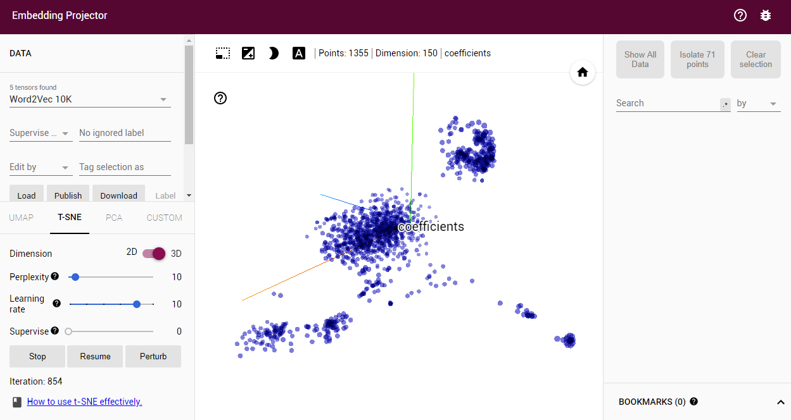
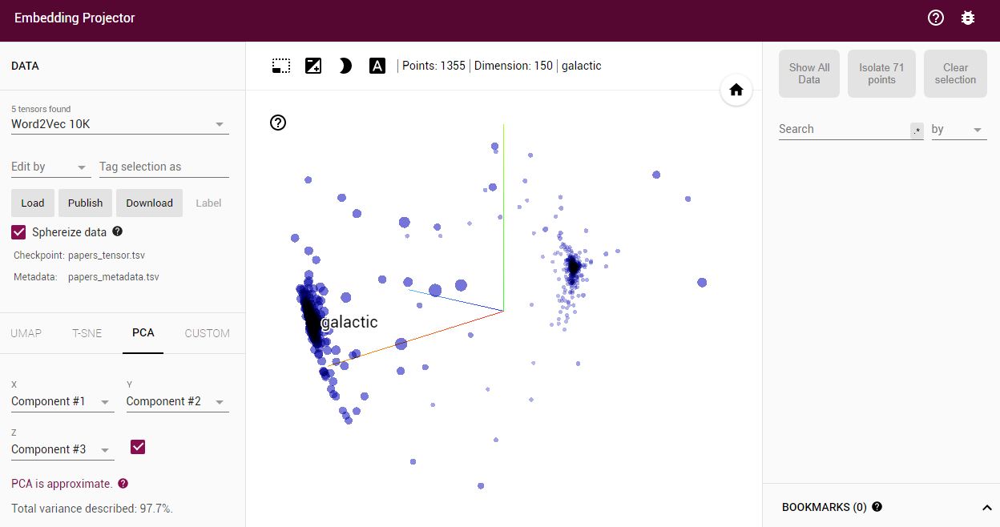

# Measuring text similarities with Word2Vec

Generating a Word2Vec model with `gensim` based on analyzing three of my academic
publications: *Shannon et al. 2015, 2016, [2018](http://adsabs.harvard.edu/abs/2018ApJ...855...32S)*

Model tensor:
https://github.com/mattjshannon/textsim/blob/master/textsim/resources/papers_tensor.tsv

Model metadata:
https://github.com/mattjshannon/textsim/blob/master/textsim/resources/papers_metadata.tsv

These can be evaluated in the TensorFlow Embedding Projector:
https://projector.tensorflow.org/

And fit with (e.g.,) t-SNE

or PCA

